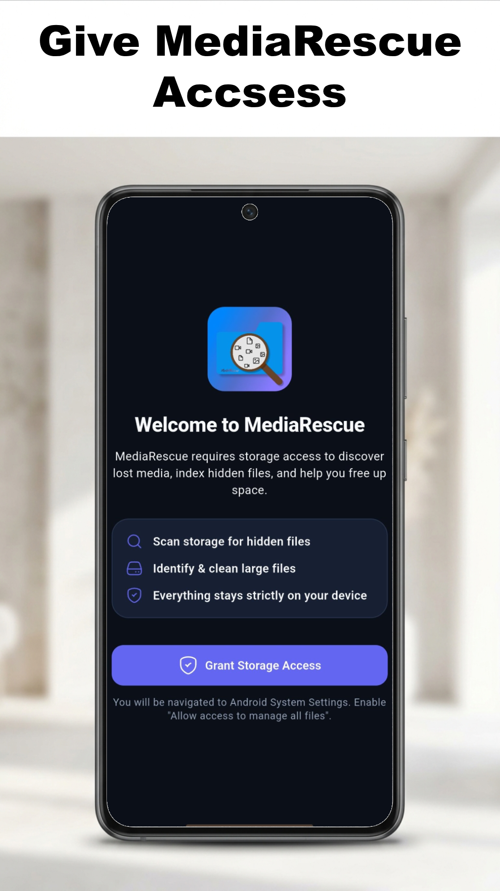
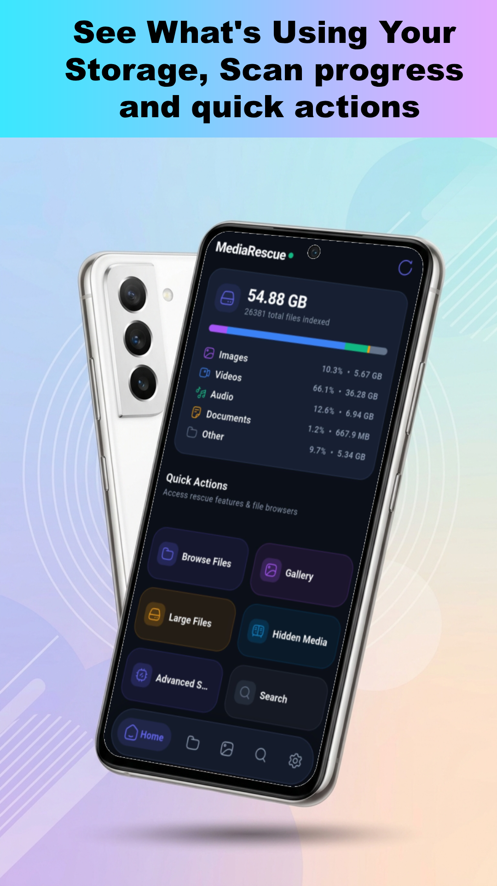
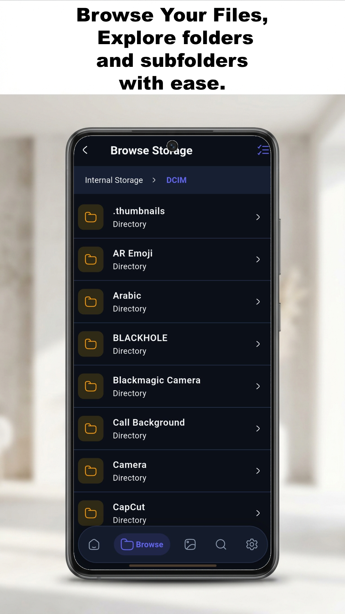
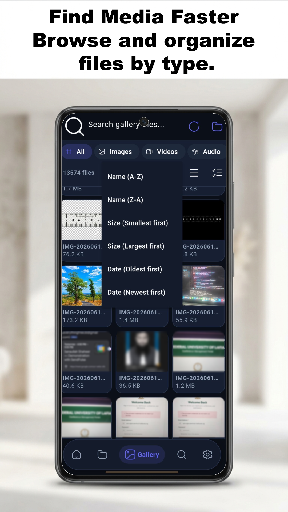
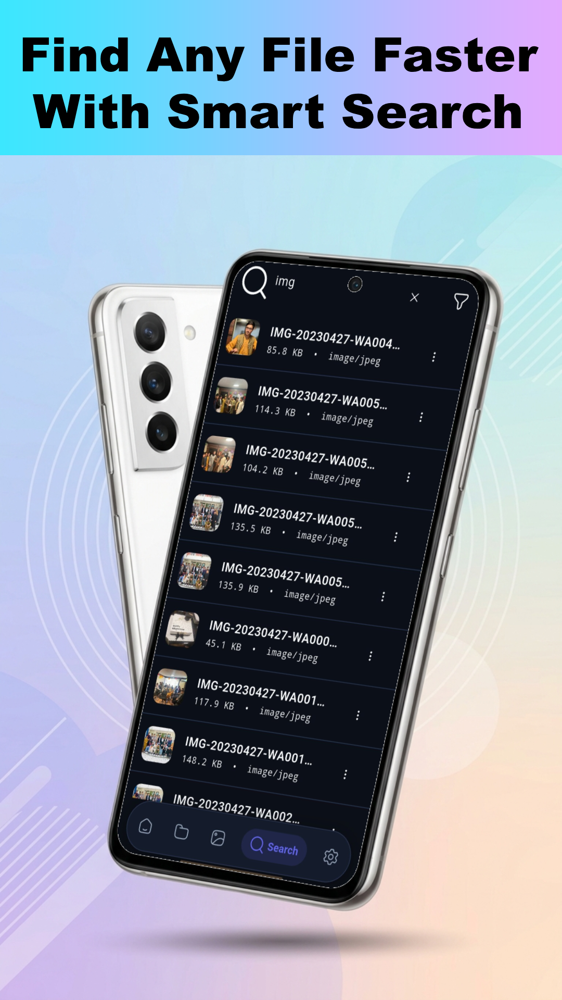
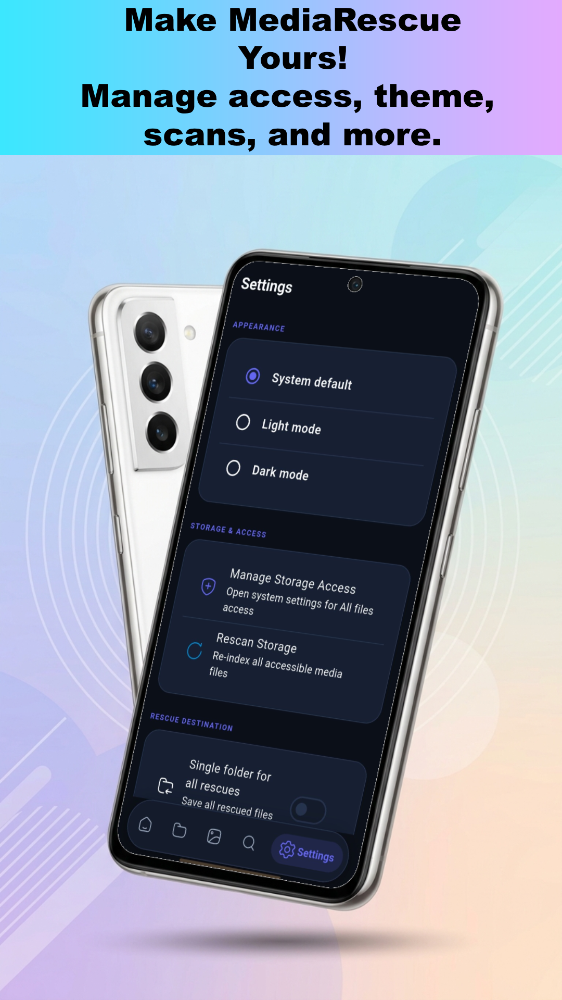
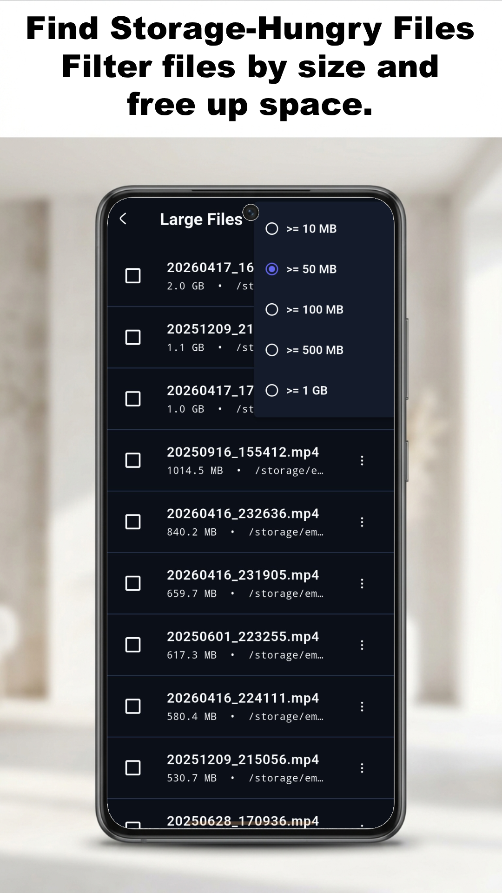
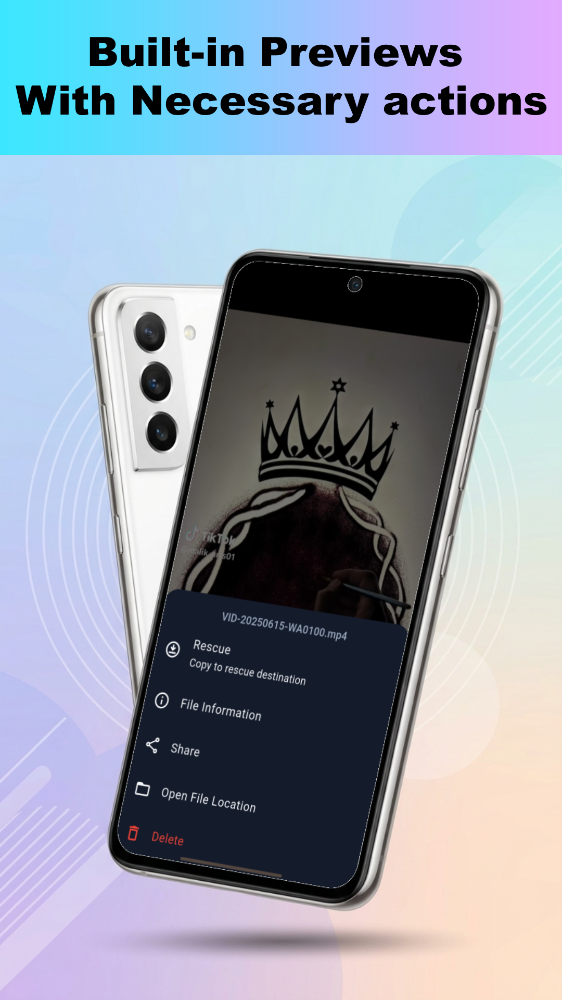

# MediaRescue

MediaRescue — Android file & media manager built with Flutter

MediaRescue helps you find, preview, and manage large and duplicate media and files on Android devices. It provides an offline-first, privacy-friendly experience for scanning storage, previewing images, videos, PDF and audio, and performing batch operations like copy, move, delete and rename.

Why this project matters: it's lightweight, open-source (MIT), and designed to run without network access — ideal for privacy-conscious users and app stores like F-Droid and Google Play.

---

## Table of Contents

- [Badges](#badges)
- [Features](#features)
- [Screenshots / Demo](#screenshots--demo)
- [Supported Platforms](#supported-platforms)
- [Installation](#installation)
  - [From Release (APK)](#from-release-apk)
  - [From F-Droid](#from-f-droid)
  - [From Google Play Store](#from-google-play-store)
- [Build from Source](#build-from-source)
  - [Prerequisites](#prerequisites)
  - [Clone & Install](#clone--install)
  - [Run (Debug)](#run-debug)
  - [Build Release APK](#build-release-apk)
  - [Build Release AAB (Play Store)](#build-release-aab-play-store)
- [App Features & Usage Guide](#app-features--usage-guide)
- [Permissions](#permissions)
- [Architecture & Developer Notes](#architecture--developer-notes)
  - [Project Structure](#project-structure)
  - [Key Files](#key-files)
  - [Tech Stack](#tech-stack)
- [Testing](#testing)
- [Contributing](#contributing)
- [Releases & Distribution](#releases--distribution)
- [Changelog](#changelog)
- [FAQ](#faq)
- [License](#license)

---

## Badges

[](https://flutter.dev)
[](https://dart.dev)
[](LICENSE)
[](https://github.com/everythingfreee/MediaRescue/releases)
[]()
[](https://github.com/everythingfreee/MediaRescue/pulls)
[]()
[]()

---

## Features

### Full Storage Scanning

- Recursively scans shared storage (`/storage/emulated/0`) and removable roots (SD cards).
- Fast background scanning with real-time progress events and incremental results.
- Scans can be saved and loaded locally to avoid re-scanning the same storage repeatedly.

### Intelligent Gallery View

- Files are automatically grouped by folder, image, video, audio, PDF and other file types.
- Thumbnail generation for smoother, faster browsing of media-heavy directories.

### Built-in Media Previews

- **Images** — pinch-to-zoom and pan with a polished viewer (`photo_view`).
- **Videos** — smooth in-app playback (`video_player`).
- **PDFs** — native-style PDF rendering (`flutter_pdfview`).
- **Audio** — in-app audio playback.

### Batch Operations

- Multi-select files with a dedicated selection UI.
- Perform **copy**, **move**, **delete**, and **rename** operations on multiple files at once.
- Bottom action bar makes bulk actions quick and intuitive.

### Large Files Finder

- Dedicated Large Files view to identify files that consume the most space.
- Filter by file size and reclaim storage quickly.

### Hidden Media Detector

> **New in v1.0.5**

- A dedicated **Hidden Media** screen (also on the Home screen) surfaces media that Android's gallery never shows you.
- Classification uses **combined independent signals** — never a single naive rule:
  - **Hidden directory** — the file lives under a dot-directory (`.`).
  - **`.nomedia` detected** — the file sits under a directory containing a `.nomedia` marker (checked on a background isolate).
  - **Missing from MediaStore** — the file exists on disk but is not surfaced through Android's media index.
  - **Unusual location** — app-private (`Android/data`, `Android/obb`) or cache/temp/backup-style directories.
  - **Deep path** — unusually deep directory nesting.
- Every item shows exactly **why** it was classified (only the signals that are actually true) via "Why hidden?" — detection is clearly labelled as heuristic, and normal media in Downloads, messaging apps or DCIM is **not** flagged just for being outside DCIM.
- **View options** — switch between a dense **List** (with inline reasons) and **Large Icons** (thumbnail grid, mirroring the Gallery), plus a **name search** and **Smart Filters** (file type, size, date, storage — scoped to Hidden Media so Search filters stay untouched).
- Fully offline, computed from the existing scan index — no re-scanning and no server.

### File Actions: Information & Open Location

> **New in v1.0.5**

- On the **Search**, **Large Files** and **Hidden Media** screens, every result row now has a **⋮ file-actions** menu with:
  - **Information** — the existing detailed metadata sheet (name, size, type, path, modified date, media metadata when available).
  - **Open Location** — jumps the in-app **Browse** tab straight to the file's containing folder (with a system file-manager fallback for SD-card paths).

### Search

- Fast search across scanned file names and paths.
- Locate files instantly without browsing through folders manually.

### Smart Filters

> **New in v1.0.2**

- **Combinable filters** — narrow thousands of discovered files by narrowing multiple criteria at once (e.g. `videos` **+** `> 500 MB` **+** `modified within 1 year` **+** `hidden`).
- Filter by **file type** (images, videos, audio, documents, PDFs, archives), **file size** (> 10 MB / > 100 MB / > 500 MB / > 1 GB), **modified date** (today / 7 days / 30 days / 1 year) and **storage location** (internal storage / SD card).
- Compatible with search — filters and the text query compose together over the scanned index.
- **Zero re-scanning** — filters operate purely on the already-indexed `FileItem` metadata (path, name, size, mimeType, modifiedDate), so changing a filter is instant.
- Live feedback: filter button badge shows how many filter groups are active, and active filters appear as removable chips above the results.

### Folder Picker & Browser

- Browse directories manually with a folder picker.
- Directory listing and file info screens with detailed metadata (size, type, modified date, path).

### Modern UI / UX

- Light & Dark themes with Material 3 design.
- Fast, declarative navigation powered by GoRouter.
- Clean onboarding flow with permission guidance.

### Privacy First

- All scanning, previews and processing happen locally on your device — your files are never uploaded.
- Optional update notifications via Firebase Cloud Messaging and Google Play In-App Updates (no analytics, no tracking, no accounts).

---

## Screenshots / Demo

> Screenshots: See a preview of the app before installing...

| Onboarding | Home / Library | Gallery | Preview |
|---|---|---|---|
|  |  |  |  |

| Large Files | Search | Browse | Settings |
|---|---|---|---|
|  | |  |  |

**Demo video:** coming soon

> Contributors welcome: If you'd like to help capture screenshots or record a demo, please see [Contributing](#contributing). Recommended screenshot size: 1080 × 1920 px (PNG). Demo format: optimized GIF or MP4.

---

## Supported Platforms

| Platform | Status |
|---|---|
| **Android** | Primary target (API 21+) |
| iOS | Not supported in this release |
| Desktop / Web | Not supported (uses Android-native storage APIs) |

> Note: MediaRescue relies on Android-native APIs for storage access and thumbnails. It is designed for Android phones and tablets.

---

## Installation

MediaRescue is distributed through multiple channels — pick whichever works best for you.

### From Release (APK)

1. Go to the [GitHub Releases](https://github.com/everythingfreee/MediaRescue/releases) page.
2. Download the latest `.apk` file.
3. On your Android device, allow installation from unknown sources if prompted.
4. Open the downloaded APK to install MediaRescue.

> Tip: Always verify the APK checksum listed in the release notes to ensure authenticity.

### From F-Droid

> Status: Planned

Once published, MediaRescue will be available directly from the [F-Droid](https://f-droid.org) store. F-Droid users can install it like any other app:

1. Install the [F-Droid client](https://f-droid.org/) (if not already installed).
2. Search for **"MediaRescue"**.
3. Tap **Install**.

### From Google Play Store

> Status: Planned

MediaRescue will be published on the Google Play Store as a free, open-source app. Search for **"MediaRescue"** once it's live.

---

## Build from Source

Want to build the app yourself? Great — it's fully open source. Follow the steps below.

### Prerequisites

| Tool | Version | Link |
|---|---|---|
| **Flutter SDK** | 3.x (with Dart 3.x) | [flutter.dev](https://flutter.dev) |
| **Android SDK** | API 21+ (compile SDK 35) | [developer.android.com](https://developer.android.com/studio) |
| **Android Studio** | Latest (recommended) | [Android Studio](https://developer.android.com/studio) |
| **Java** | 17+ (bundled with Android Studio) | — |

### Clone & Install

```bash
git clone https://github.com/everythingfreee/MediaRescue.git
cd MediaRescue
flutter pub get
```

### Run (Debug)

```bash
# List connected devices/emulators
flutter devices

# Run in debug mode on a specific device
flutter run -d <device-id>
```

### Build Release APK

```bash
flutter build apk --release
```

The APK will be generated at:

```
build/app/outputs/flutter-apk/app-release.apk
```

### Build Release AAB (Play Store)

```bash
flutter build appbundle --release
```

The AAB will be generated at:

```
build/app/outputs/bundle/release/app-release.aab
```

> Note for F-Droid: To publish to F-Droid, you'll need to provide reproducible build metadata and follow the [F-Droid packaging guidelines](https://f-droid.org/en/docs/Packaging_Applications/). This includes metadata files, build scripts, and compatible licenses.

---

## App Features & Usage Guide

### 1. Grant Storage Permission

On first launch, MediaRescue will guide you through granting storage access:

- On **Android 11+**, you'll be prompted to enable **"All files access"** (Settings → Special app access → All files access → MediaRescue).
- On **Android 10 and below**, MediaRescue uses legacy external storage permissions (`READ`/`WRITE_EXTERNAL_STORAGE`).

### 2. Scan Storage

- From the **Home** screen, tap **Start Scan** to scan the entire shared storage.
- Progress is shown live with the current directory, files discovered, and directories scanned.
- Scanning runs in the background — you can keep using the app.

### 3. Browse & Filter

- Switch between views: **Gallery** (media grouped by type), **Folders** (directory browser), and **Large Files**.
- Filter files by type: images, video, audio, PDF, and other formats.

### 4. Preview Files

Tap any file to open a built-in preview:

- **Images** → zoom & pan viewer.
- **Videos** → in-app video player.
- **PDFs** → PDF viewer.
- **Audio** → audio player.

### 5. Select & Manage Files

- **Long-press** any file to enter selection mode.
- Select multiple files, then use the **bottom action bar** to:
  - **Copy**
  - **Move**
  - **Delete**
  - **Rename**

### 6. Save & Load Scans

- **Save** a scan result to quickly re-open it later without rescanning.
- **Load** previously saved scans from the browse screen.
- **Clear** scan data when you no longer need it.

### 7. Find Large Files

- Navigate to the **Large Files** tab.
- Sort by file size to quickly find storage hogs.
- Delete or move large files in bulk to free up space.

### 8. Search

- Use the **Search** screen to find files by name anywhere in the scanned storage.

### 9. Smart Filters (v1.0.2)

- On the **Search** screen, tap the **filter** icon in the top-right corner to open **Smart Filters**.
- Combine multiple criteria — file type, size, modified date, and storage location.
- Results update instantly as you change filters; a badge on the filter button shows how many filter groups are active.
- Tap the **×** on any active filter chip above the results to remove it, or **Clear all** inside the sheet to reset everything.
- Filters work together with the search box — no re-scan is triggered.

---

## Permissions

MediaRescue requires storage access to scan and manage files. Here's exactly what's used and why:

| Permission | Android Version | Purpose |
|---|---|---|
| `MANAGE_EXTERNAL_STORAGE` | Android 11+ | **"All files access"** — required for full storage scanning & management |
| `READ_EXTERNAL_STORAGE` | Android 5–10 (maxSdk 32) | Read public media and files |
| `WRITE_EXTERNAL_STORAGE` | Android ≤ 9 (maxSdk 29) | Copy / move / delete files |

### Privacy Guarantee

> **MediaRescue performs all scanning and processing locally on your device.**
>
> - No uploading of your media files, ever
> - No analytics or telemetry
> - No accounts, no tracking
> - Core scanning, browsing, previews and file operations work fully offline
> - Optional online features: Firebase Cloud Messaging update notifications and Google Play In-App Updates (see the [Privacy Policy](https://everythingfreee.github.io/Apps-Privacy-Policy/Apps-Privacy-Policy/mediarescue.html))

Your files never leave your device. The optional notification and update features only communicate with Google's Firebase and Play services — they never access file contents.

---

## Architecture & Developer Notes

### Project Structure

```
mediarescue/
├── android/                                  # Android platform wrapper
│   ├── app/
│   │   ├── src/main/
│   │   │   ├── AndroidManifest.xml           # Permissions & app config (storage, INTERNET, POST_NOTIFICATIONS, FileProvider)
│   │   │   ├── res/xml/file_paths.xml        # FileProvider paths used for sharing files
│   │   │   └── kotlin/com/shaheer/mediarescue/mediarescue/
│   │   │       └── MainActivity.kt           # Native Kotlin: MethodChannel (scan, list, copy/move/delete, thumbnails, media info, MediaStore index), EventChannel scan stream, Open-File-Location, rescue settings
│   │   ├── build.gradle.kts                  # App module build config & signing
│   │   └── google-services.json              # Firebase config (git-ignored)
│   ├── build.gradle.kts                      # Root Gradle config
│   ├── settings.gradle.kts                   # Gradle plugin management (incl. FlutterFire)
│   └── key.properties                        # Signing keys reference (git-ignored — never commit)
├── lib/
│   ├── main.dart                             # App entrypoint: Firebase init (optional), Riverpod ProviderScope, FCM + in-app update wiring
│   ├── firebase_options.dart                 # Generated Firebase options (FlutterFire CLI)
│   ├── app/
│   │   ├── app.dart                          # Root MaterialApp.router, theme mode notifier, global router/nav keys
│   │   ├── routes.dart                       # go_router route table (shell tabs + full-screen routes: large-files, hidden-media, previews, settings pages)
│   │   └── theme/
│   │       └── app_theme.dart                # Material 3 light/dark theme definitions
│   ├── models/
│   │   ├── file_item.dart                    # FileItem — file & folder data model (path, name, size, type, MIME, modified)
│   │   ├── hidden_media.dart                 # HiddenMediaReason (5 signals) + HiddenMediaItem + combined-evidence classifier
│   │   └── smart_filter.dart                 # SmartFilterState + filter enums (type, size, date, location)
│   ├── providers/                            # Riverpod state management
│   │   ├── advanced_scan_provider.dart       # Shizuku Advanced Scan: state + lifecycle + read-only results
│   │   ├── browser_provider.dart             # Current directory navigation state (incl. "Open Location" resetTo)
│   │   ├── filter_provider.dart              # smartFilterProvider + applySmartFilters() filter engine (in-memory, no re-scan)
│   │   ├── gallery_provider.dart             # Gallery folder selection, grouping, filter/sort state
│   │   ├── hidden_media_provider.dart        # Hidden Media computation: classifier + .nomedia isolate check + MediaStore lookup; view/search/filter state
│   │   ├── rescue_provider.dart              # Rescue destination settings + rescue operation (copy → verify → index)
│   │   ├── scanner_provider.dart             # Scan progress/results, search results, large-files list, storage stats
│   │   ├── selection_provider.dart           # Multi-select state shared across screens
│   │   └── storage_provider.dart             # StorageService provider wiring
│   ├── screens/
│   │   ├── scaffold_with_nav_bar.dart        # Root scaffold with bottom navigation (Home/Browse/Gallery/Search/Settings)
│   │   ├── advanced_scan/                    # OPTIONAL Shizuku Advanced Scanner screens
│   │   │   ├── advanced_scan_screen.dart     # Shizuku status, scan controls, progress, lazy read-only results list
│   │   │   └── shizuku_guide_screen.dart     # In-app text setup guide with official source links + video placeholder
│   │   ├── browse/
│   │   │   └── browse_screen.dart            # Folder browser: breadcrumbs, navigation, multi-select, previews
│   │   ├── gallery/
│   │   │   ├── gallery_screen.dart           # Gallery: folder picker entry, grid/list, filters, sort, search
│   │   │   ├── file_info_screen.dart         # Detailed file information screen
│   │   │   └── folder_picker_screen.dart     # Directory chooser for the gallery
│   │   ├── hidden_media/
│   │   │   └── hidden_media_screen.dart      # Hidden Media: results with per-item reasons, List/Large-Icons views, search + Smart Filters, "Why hidden?" sheet, empty states
│   │   ├── home/
│   │   │   └── home_screen.dart              # Home: scan progress, storage summary, quick actions (Hidden Media, Large Files, Advanced Scanning…), cleanup suggestions
│   │   ├── large_files/
│   │   │   └── large_files_screen.dart       # Large Files: size threshold filter, multi-select delete, file actions
│   │   ├── onboarding/
│   │   │   └── permission_screen.dart        # First-launch "All files access" guidance
│   │   ├── preview/
│   │   │   ├── immersive_media_viewer_screen.dart  # Vertical media feed: gestures, rescue, tour, actions menu
│   │   │   ├── image_viewer_screen.dart      # Standalone image viewer
│   │   │   ├── video_player_screen.dart      # Standalone video player
│   │   │   ├── audio_player_screen.dart      # In-app audio player
│   │   │   └── pdf_viewer_screen.dart        # In-app PDF viewer
│   │   ├── search/
│   │   │   └── search_screen.dart            # Search + Smart Filters + active-filter chips + file actions
│   │   └── settings/
│   │       ├── settings_screen.dart          # Settings: rescan, rescue destinations, notifications, navigation links
│   │       ├── about_screen.dart             # About page (version, GitHub link)
│   │       ├── contact_screen.dart           # Contact page (email/GitHub/Issues)
│   │       └── privacy_policy_screen.dart    # In-app privacy policy summary
│   ├── services/
│   │   ├── storage_service.dart              # StorageService abstraction + MethodChannel implementation
│   │   ├── advanced_scan_service.dart        # Shizuku Advanced Scanner MethodChannel + EventChannel bridge (dedicated channels)
│   │   ├── notification_service.dart         # FCM listeners, topic subscription, foreground notifications
│   │   ├── update_service.dart               # Google Play In-App Update check (Flexible update flow)
│   │   └── link_service.dart                 # URL/email launch helpers
│   └── widgets/
│       ├── file_actions_sheet.dart           # Shared file-actions sheet (Information / Open Location / Preview)
│       ├── media_info_sheet.dart             # Detailed metadata bottom sheet (resolution, duration, bitrate…)
│       ├── selection_bottom_bar.dart         # Bottom action bar for bulk operations (copy/move/delete/rename)
│       ├── smart_filter_sheet.dart           # Smart Filters bottom-sheet UI (chips, radios, storage checkboxes; injectable provider)
│       └── thumbnail_image.dart              # Cached media thumbnail widget
├── test/
│   └── widget_test.dart                      # Widget tests
├── fastlane/metadata/                        # Store metadata & screenshots
├── pubspec.yaml                              # Dependencies & app metadata (version 1.0.5+6)
├── analysis_options.yaml                     # Lint rules (flutter_lints)
├── README.md                                 # You are here
├── LICENSE                                   # MIT license
└── CHANGELOG.md                              # Version history
```

### Key Files

| File | Purpose |
|---|---|
| `lib/main.dart` | App entry point; boots Riverpod `ProviderScope` + `MediaRescueApp` |
| `lib/app/app.dart` | Root widget; theme, router, and global configuration |
| `lib/app/routes.dart` | Centralized `go_router` route table |
| `lib/services/storage_service.dart` | Storage abstraction + MethodChannel implementation (`MethodChannelStorageService`) |
| `lib/providers/` | Riverpod providers for scanning, gallery, selection, and browser state |
| `lib/screens/` | All UI screens (gallery, browse, preview, settings, etc.) |
| `lib/models/file_item.dart` | `FileItem` model (path, name, size, type, MIME, modified date) |
| `lib/models/smart_filter.dart` | `SmartFilterState` + filter enums (type, size, date) |
| `lib/providers/filter_provider.dart` | `smartFilterProvider` + `applySmartFilters()` filter engine (in-memory, no re-scan) |
| `lib/widgets/smart_filter_sheet.dart` | Smart Filters bottom-sheet UI (chips, radios, storage checkboxes) |

### Tech Stack

| Layer | Technology |
|---|---|
| **Framework** | [Flutter](https://flutter.dev) 3.x |
| **Language** | [Dart](https://dart.dev) 3.x |
| **State Management** | [Riverpod (flutter_riverpod ^3.x)](https://riverpod.dev) |
| **Navigation** | [go_router ^17.x](https://pub.dev/packages/go_router) |
| **Image Viewer** | [photo_view ^0.15.x](https://pub.dev/packages/photo_view) |
| **Video Player** | [video_player ^2.x](https://pub.dev/packages/video_player) |
| **PDF Viewer** | [flutter_pdfview ^1.4.x](https://pub.dev/packages/flutter_pdfview) |
| **Cloud Messaging** | [Firebase Core ^4.x](https://pub.dev/packages/firebase_core) · [firebase_messaging ^16.x](https://pub.dev/packages/firebase_messaging) |
| **Local Notifications** | [flutter_local_notifications ^20.x](https://pub.dev/packages/flutter_local_notifications) |
| **In-App Updates** | [in_app_update ^4.x](https://pub.dev/packages/in_app_update) (Google Play Flexible Update) |
| **App Version** | [package_info_plus ^8.x](https://pub.dev/packages/package_info_plus) |
| **Links / Email** | [url_launcher ^6.x](https://pub.dev/packages/url_launcher) |
| **Native Bridge** | Android MethodChannel (Kotlin) |
| **UI** | Material 3 (light/dark themes) |

---

## Testing

```bash
# Run all tests
flutter test

# Run with coverage
flutter test --coverage
```

---

## Contributing

Contributions are what make the open-source community such an amazing place to learn, inspire, and create. Any contributions you make are greatly appreciated.

### Ways to Contribute

- **Report bugs** — open a [GitHub Issue](https://github.com/everythingfreee/MediaRescue/issues) with steps to reproduce and device details.
- **Suggest features** — open a feature request issue.
- **Submit PRs** — bug fixes, performance improvements, UI enhancements.
- **Translate** — add new languages / improve existing translations.
- **Accessibility** — help improve a11y support.
- **Screenshots & demos** — help us build the screenshot gallery.

### Getting Started

```bash
# 1. Fork the repository
#    Click "Fork" at https://github.com/everythingfreee/MediaRescue

# 2. Clone your fork
git clone git@github.com:<your-username>/MediaRescue.git
cd MediaRescue

# 3. Create a feature branch
git checkout -b feat/your-feature

# 4. Install dependencies
flutter pub get

# 5. Make your changes & run the app
flutter run

# 6. Run tests
flutter test

# 7. Commit & push
git add .
git commit -m "feat: add your awesome feature"
git push --set-upstream origin feat/your-feature

# 8. Open a Pull Request against the upstream repository
```

### Guidelines

- Keep PRs small and focused — one feature/fix per PR.
- Follow the existing code style (`dart format`, effective Dart).
- Add/update tests for new functionality.
- Include screenshots or recordings for UI changes.
- Keep everything offline-first and privacy-friendly.
- Be kind and respectful.

---

## Changelog

### v1.0.6 — Shizuku-Based Advanced Scanning

**Added: Shizuku-Based Advanced Scanning**

- New optional Advanced Scanning feature that uses [Shizuku](https://github.com/RikkaApps/Shizuku) to read `Android/data` and `Android/obb` directories that MediaRescue cannot normally access.
- Advanced Scanning is **completely optional** — MediaRescue works exactly the same if Shizuku is not installed, not running, or authorization is denied. The existing normal scanner is untouched and never routed through Shizuku.
- The scan roots are hard-limited and read-only: only `/storage/emulated/0/Android/data` and `/storage/emulated/0/Android/obb`. The privileged `MediaRescueUserService` runs in the Shizuku execution context and only exposes deliberately narrow, read-only AIDL operations (existence check, directory listing, recursive traversal, metadata: name, path, size, modified time).
- **Path security**: the user service rejects any path outside the two approved roots (canonical-path check, no symlinks/escapes), and the Flutter layer passes no paths — roots are fixed in native code. No delete, rename, move, write, chmod, chown, or shell execution is exposed.
- **Progress & cancellation**: the scan runs off the UI thread, streams throttled progress events, and can be cancelled at any time. If Shizuku disconnects mid-scan, the scan stops gracefully with a clear explanation — the app never crashes.
- **Setup guide**: an in-app, text-based Shizuku Setup Guide explains installation, starting the service, and granting authorization. Official Shizuku sources are linked; MediaRescue never bundles or auto-installs Shizuku.

**Added: Advanced Scanning UI**

- New **Advanced Scanning** tile in Home → Quick Actions, matching the existing tile style (icon + label, color from the theme).
- Dedicated **Advanced Scanning** screen: shows live Shizuku status (Not installed / Not running / Authorized / Ready / …), a **Start Advanced Scan** button, progress counters (files found, errors, per-root status), a cancel button, and a lazy-scrolling read-only results list (name, relative path, size/type).
- New **Settings → Advanced Scanning** section showing live Shizuku status, plus a link to the setup guide.

**Updated: Advanced Scanning cache and workflow**

- Advanced Scanning restores files already copied to its local preview cache when the page opens, so cached results remain available even when Shizuku is disconnected.
- A fresh scan is performed only when the user presses **Rescan**; the Shizuku connection indicator and Rescan control remain pinned at the bottom of the screen while results scroll.
- Cached files reuse their accessible local copies for previews, thumbnails and rescue operations without requiring another Shizuku transfer.
- Preview preparation shows a loading indicator, grid selection shows a checkmark, and rescued files are indexed immediately through Android's media refresh API so they appear in Gallery without delay.

**Files added**

- `lib/services/advanced_scan_service.dart` — dedicated MethodChannel + EventChannel bridge for the optional feature (independent channel names, never touches the normal scanner's channels).
- `lib/providers/advanced_scan_provider.dart` — Riverpod controller + `AdvancedScanState` (shizuku status, scan lifecycle, accumulated read-only results, progress counts, per-root statuses).
- `lib/screens/advanced_scan/advanced_scan_screen.dart` — the Advanced Scanning screen (status, progress, results list, cancel).
- `lib/screens/advanced_scan/shizuku_guide_screen.dart` — in-app text setup guide with official source links and a video-placeholder card for future extension.
- `android/app/src/main/aidl/com/shaheer/mediarescue/shizuku/IAdvancedScanner.aidl` — narrow read-only AIDL interface.
- `android/app/src/main/aidl/com/shaheer/mediarescue/shizuku/IAdvancedScannerCallback.aidl` — `oneway` callback for progress/results.
- `android/app/src/main/kotlin/com/shaheer/mediarescue/mediarescue/AdvancedScannerUserService.kt` — privileged user service implementing the AIDL, hard-limited to the two read-only roots with path validation on every operation.
- `android/app/src/main/kotlin/com/shaheer/mediarescue/mediarescue/ShizukuManager.kt` — Shizuku availability/authorization detection, user-service lifecycle, binder-death handling, and state → Flutter bridge.

**Files modified**

- `android/app/src/main/AndroidManifest.xml` — registered the user service (non-exported) and the official `ShizukuProvider` per the Shizuku API docs.
- `lib/app/routes.dart` — added `/advanced-scan` and `/shizuku-guide` full-screen routes (pushed on top of the shell like Large Files, so Back returns to the originating screen).
- `lib/screens/home/home_screen.dart` — added the Advanced Scanning quick-action tile.
- `lib/screens/settings/settings_screen.dart` — added the Advanced Scanning settings section.
- `pubspec.yaml` — version bumped to `1.0.6+7`.

### v1.0.5 — Hidden Media, Navigation Stability & File Actions

**Fixed: Large Files blank-screen bug**

- Opening **Large Files** repeatedly (and navigating between screens) could eventually leave the app on a completely blank/white page while the bottom navigation bar stayed visible.
- Root cause: `/large-files` is a full-screen route **outside** the bottom-navigation shell, and it was opened with `context.go(...)`. `go` *replaces* the whole route stack — tearing down all five tab screens (with their live streams, futures and listeners) and recreating them on every open/close. Combined with `context.go('/home')` being called from the screen's own context during back handling, the navigation state could become invalid after repeated visits.
- Fix: Large Files is now **pushed on top** of the shell (`context.push`), so the app underneath stays alive; Back simply pops the route. The manual `PopScope` interception (which invoked navigation during route disposal) was removed.

**Fixed: Large Files Back navigation**

- Pressing Back from Large Files now **returns to the screen you came from** — Home → Large Files → Back → Home, Settings → Large Files → Back → Settings, same for Search, Browse and Gallery. No hard-coded jump to Home.

**Added: 🕵️ Hidden Media**

- New **Hidden Media** destination on the Home screen, making MediaRescue's purpose immediately obvious.
- A dedicated Hidden Media screen lists media classified as hidden/unusual using **multiple independent signals**, combined as evidence rather than a single rule:
  - **hiddenDirectory** — the file is inside a dot-directory (e.g. `.folder`).
  - **.nomedia** — the file sits under a directory containing a `.nomedia` marker (the reason Android gallery apps skip it); checked efficiently on a background isolate.
  - **mediaStoreMissing** — the file exists in accessible storage but is not surfaced through Android's MediaStore index (queried once via a new native `getMediaStorePaths` channel API; if that query fails, the signal is skipped, never guessed).
  - **unusualLocation** — app-private directories (`Android/data`, `Android/obb`) or cache/temp/backup-style directories. Legitimate locations like Downloads and messaging-app media folders are **not** flagged on their own.
  - **deepPath** — unusually deep directory nesting (threshold configurable in code, default 6 directories below the storage root).
- Classification: hidden directories and `.nomedia` are strong signals on their own; app-private locations count as strong; otherwise at least two weak signals must agree. Normal media in DCIM/Pictures/Downloads stays unflagged.
- Every item explains **why** it was classified — a "Why hidden?" sheet lists only the signals that are actually true (e.g. "✓ Located in a .nomedia directory"), with a clear note that detection is heuristic.
- **View options & Smart Filters on Hidden Media**: toggle between **List** and **Large Icons** (thumbnail grid) views, search hidden items by name, and combine Smart Filters (type, size, date, storage) — scoped to the Hidden Media screen so the Search screen's filters are unaffected; shared filter engine, zero re-scan.
- Proper empty state ("No Hidden Media Found — MediaRescue didn't find any media matching the hidden/unusual criteria."), a "no matching results" state when search/filters narrow everything away, loading state, and graceful handling of permission failures, deleted files and MediaStore query errors — one inaccessible file never breaks the scan.
- Zero re-scan: detection runs over the existing in-memory scan index; the only filesystem work is the one-shot `.nomedia` check in an isolate.

**Added: File actions on Search & Large Files (and Hidden Media)**

- Result rows now have a **⋮** menu with:
  - **Information** — the existing detailed metadata sheet (filename, size, type, path, modified date, resolution/duration/bitrate when Android provides them).
  - **Open Location** — jumps the in-app **Browse** tab directly to the file's containing folder; falls back to the system file manager for paths outside internal storage (e.g. SD cards).
  - **Preview** — the row's normal tap behaviour, also reachable from the menu.
- A shared implementation is reused across Search, Large Files and Hidden Media — no duplicated code.

**New files**

- `lib/models/hidden_media.dart` — `HiddenMediaReason` (signal model) + `HiddenMediaItem` + combined-evidence classifier.
- `lib/providers/hidden_media_provider.dart` — Hidden Media computation (index classification, `.nomedia` isolate check, MediaStore lookup) + view/search/filter state.
- `lib/screens/hidden_media/hidden_media_screen.dart` — the Hidden Media screen (results, reasons, List/Large-Icons views, search + Smart Filters, empty/loading/error states).
- `lib/widgets/file_actions_sheet.dart` — shared file-actions sheet + in-app "Open Location" helper.
- `lib/widgets/smart_filter_sheet.dart` — now accepts an injectable filter provider (reused by Hidden Media).

**Modified**

- `lib/app/routes.dart` — added the `/hidden-media` route.
- `lib/screens/large_files/large_files_screen.dart` — navigation/back fix, ⋮ file-actions menu.
- `lib/screens/search/search_screen.dart` — ⋮ file-actions menu on results.
- `lib/screens/home/home_screen.dart` — Hidden Media quick-action tile; Large Files opened with push.
- `lib/screens/settings/settings_screen.dart` — Large Files opened with push.
- `lib/providers/browser_provider.dart` — `resetTo()` for "Open Location".
- `lib/services/storage_service.dart` — new `getMediaStorePaths()` channel API.
- `android/.../MainActivity.kt` — native `getMediaStorePaths` (MediaStore query on the background executor).

### v1.0.4 — Update Notifications, In-App Updates, About & More

**Added: Firebase Cloud Messaging update notifications**

- MediaRescue can now announce new releases via **Firebase Cloud Messaging** (manual sends from the Firebase Console — no backend, no server code).
- Installations subscribe to the topic **`mediarescue-updates`**; no accounts, login or email required, and FCM tokens are never sent to any external server.
- Notification permission (Android 13+) is requested once, right after onboarding, without breaking the flow. If denied, the app works exactly as before and you can enable update notifications any time from **Settings → Notifications**.
- Tapping an update notification opens the **Google Play Store page** for MediaRescue (native Play Store app preferred, browser fallback if unavailable).
- Foreground notifications are shown locally so announcements are visible while the app is open; background messages use the system notification tray — never duplicated.

**Added: Google Play In-App Updates**

- On launch, MediaRescue checks Google Play (in the background — the Home screen stays usable) and shows the standard **"MediaRescue update available"** dialog with **[Update] [Skip]**.
- Uses the official **Flexible Update** flow: you can keep using MediaRescue while the update downloads, then choose **"Restart to install"** when it's done. Google Play performs the actual installation — no custom APK updater.
- Skipping hides the same update for the current session only; a newer release can still be announced later.
- No update → no dialog. Google Play or network unavailable → app continues normally.

**Added: About, Contact & Privacy Policy pages**

- New **Settings → About** page with the app icon, dynamic version number, description, GitHub link, and links to the new Contact and Privacy Policy pages.
- New **Contact** page with the official email (`mediarescue@sanaullahshaheer.dpdns.org`) and an **Email Us** `mailto:` action, plus the GitHub repository and Issues links.
- New **Privacy Policy** page with an accurate in-app summary (storage access, local scanning, FCM, Google Play, user controls) and a **Read Full Privacy Policy** link to the official hosted policy.

**Other**

- `INTERNET` and `POST_NOTIFICATIONS` Android permissions added (only used by FCM / Play updates / links — all optional).
- Version bumped to **1.0.4 (build 5)**.
- MediaRescue remains fully usable offline: scanning, gallery, search, browser, previews, large files and file operations are unchanged and never depend on Firebase or Google Play.

---

### v1.0.3 — Immersive Media Preview & Rescue Experience

**Added: Immersive Media Viewer (TikTok/Reels-style preview with one-gesture rescue)**

- Brand-new **vertically scrollable media viewer** used *everywhere* the app previews images or videos (Gallery grid & list, Browse, Search). Swipe up for the next file, down for the previous one; each item fills the screen with smooth page snapping and nearby preloading — distant videos are released from memory.
- Header shows a position indicator (`23 / 1482`), the filename (truncated with its extension preserved, e.g. `vacation_video_from_bamyan...mp4`) and the actual **Modified** date.
- Gestures:
  - **Tap** — play/pause the video with a brief fading indicator (no permanent play button).
  - **Double tap** — **Rescue**: copies the original file (with size verification) to the configured rescue destination, indexes the copy with Android's MediaScanner so it appears in gallery apps, shows a tasteful "✓ Rescued" flash (this is rescue — not a like), then asks **Keep Original / Delete Original**. The original is only deleted after the rescued copy is verified to exist; a failed deletion never loses data.
  - **Long press** — actions menu: Rescue, File information, Share, Open File Location, Delete (with confirmation). The menu is suppressed while the edge-hold speed gesture is active.
  - **Edge hold** — press & hold the left/right edge of a video (two ~48 dp zones) for a **temporary 2× speed** boost with a "2×" indicator; releasing restores the user-selected playback speed.
  - **Pinch in/out (video)** — **clean fullscreen**: fades away the filename, rescue and info chrome, keeping only play/pause, seek bar, durations and speed. Pinch out restores everything. A fullscreen button is also available for discoverability.
  - **Pinch zoom/pan (images)** — normal `photo_view` zoom; zooming pauses vertical feed paging until the image is restored, so the two gestures never fight.
- Video player: seek bar with immediate timestamp updates (seeking never restarts playback), play/pause button, current/total duration, playback speed selector (0.5× / 1× / 1.5× / 2×, default 1×) and correct playback state when swiping between videos.
- Controls auto-hide after inactivity and reappear on tap; the media stays the focus.
- **One-time player tour**: on the first video preview a 6-step guided tour explains swiping, tap to play/pause, double-tap rescue, edge hold 2×, pinch fullscreen and long-press actions. The system back button closes the tour first, and a help button in the video controls restarts it anytime. Shown only once (persisted natively via `SharedPreferences` through the storage channel).
- **File information sheet**: filename, size, resolution, duration, format, MIME type, frame rate, bitrate, audio details, original path, modified/creation dates — when Android can provide them; otherwise "Unavailable". Never crashes.
- Broken/unsupported media shows *"Unable to preview this file."* — Rescue, Info and other actions still work.
- The system back button closes overlays first (tour → clean fullscreen → viewer) and returns to the previous MediaRescue screen instead of exiting the app.

**Added: Rescue Destination System (Settings)**

- New **Rescue Destination** settings: one destination for everything, or per-type destinations for **Images** (`Pictures/MediaRescue`), **Videos** (`Movies/MediaRescue`), **Audio** (`Music/MediaRescue`) and **Other** (`Documents/MediaRescue`), each independently changeable.
- The preview always asks the rescue system for the correct destination — nothing is hard-coded in the viewer.

**Fixed: Gallery indexing after copy/move**

- Files copied or moved by MediaRescue are now explicitly handed to `MediaScannerConnection.scanFile()` (with MIME type) once the operation finishes, so rescued/moved media appears in normal gallery apps immediately — previously it could take minutes or require touching the file in an external file manager first.

**Improved: Open File Location**

- Now opens the phone's built-in file manager directly at the file's folder using a properly encoded `DocumentsContract` directory URI with `EXTRA_INITIAL_URI`, with explicit DocumentsUI and generic file-manager fallbacks.

**New files**

- `lib/screens/preview/immersive_media_viewer_screen.dart` — the immersive viewer: vertical feed, gestures, video player, tour, rescue flash and actions menu.
- `lib/providers/rescue_provider.dart` — rescue destination settings + rescue operation (copy → verify → index).
- `lib/widgets/media_info_sheet.dart` — detailed file information bottom sheet.
- `android/app/src/main/res/xml/file_paths.xml` — FileProvider paths used for sharing files.

**Modified**

- `lib/services/storage_service.dart` — new channel APIs: `copyFileVerified`, `getFileMediaInfo`, `indexMedia`, `createDirectory`, `shareFile`, `openFileLocation`, rescue-settings persistence and `getAppPrefBool`/`setAppPrefBool`.
- `android/app/src/main/kotlin/com/shaheer/mediarescue/mediarescue/MainActivity.kt` — native implementations for the new APIs, the media-scanning fix and the rewritten "Open File Location".
- `android/app/src/main/AndroidManifest.xml` — registered the `FileProvider` used for sharing.
- `lib/app/routes.dart` — route for the immersive viewer.
- `lib/screens/gallery/gallery_screen.dart`, `lib/screens/browse/browse_screen.dart`, `lib/screens/search/search_screen.dart` — image/video taps now open the immersive viewer with the surrounding files as feed context.
- `lib/screens/settings/settings_screen.dart` — Rescue Destination section.
- `pubspec.yaml` — version bumped to `1.0.3+4`.

---

### v1.0.2 — Smart Filters

**Added: Smart Filters for Search**

- New combinable, in-memory **Smart Filters** layer on the Search screen, letting users quickly narrow thousands of discovered files without browsing manually.
- Filter by **file type**: Images, Videos, Audio, Documents, PDFs, Archives, and Hidden files.
- Filter by **file size**: any / > 10 MB / > 100 MB / > 500 MB / > 1 GB.
- Filter by **modified date**: any / today / 7 days / 30 days / 1 year.
- Filter by **storage location**: internal storage (`/storage/emulated/0`) and/or SD card.
- All filters are **combinable (ANDed)** — e.g. `type = video` + `size > 500 MB` + `modified within 1 year` + `hidden` — fully compatible with the existing text search.
- Filters operate on the **already-indexed `FileItem` metadata** (path, name, size, mimeType, modifiedDate). **No filesystem re-scan** happens when a filter changes.
- UI improvements:
  - Filter button in the Search app bar with an **active-filter badge**.
  - **Active filter chips** above the results with one-tap removal and a "Clear all" action in the sheet.

**New files**

- `lib/models/smart_filter.dart` — `SmartFilterState`, `SmartTypeFilter`, `FileSizeFilter`, `ModifiedDateFilter`.
- `lib/providers/filter_provider.dart` — `smartFilterProvider` + `applySmartFilters()` filter engine.
- `lib/widgets/smart_filter_sheet.dart` — Smart Filters UI (bottom sheet + radio/chip controls).

**Modified**

- `lib/providers/scanner_provider.dart` — `searchResultsProvider` now composes the text query with the Smart Filters.
- `lib/screens/search/search_screen.dart` — filter button, active-filter chip bar, and filter-aware results/empty states.

---

## Releases & Distribution

MediaRescue distributes via three channels:

| Channel | Status | Artifact |
|---|---|---|
| **GitHub Releases** | Active | `.apk` + `.aab` + changelog |
| **F-Droid** | Planned | F-Droid metadata & reproducible build |
| **Google Play Store** | Planned | Signed `.aab` |

### Release Checklist

When publishing a new release:

1. Bump `version` in `pubspec.yaml`.
2. Update `CHANGELOG.md` with notable changes.
3. Build signed artifacts:
   ```bash
   flutter build appbundle --release   # for Play Store
   flutter build apk --release         # for GitHub Releases / F-Droid
   ```
4. Create a [GitHub Release](https://github.com/everythingfreee/MediaRescue/releases/new) with:
   - Version tag (e.g., `v1.0.0`)
   - Release title
   - Changelog notes
   - Attached APK/AAB files
5. Upload the AAB to Google Play Console.
6. Update F-Droid metadata (if applicable).

> Security: Never commit `key.properties` or keystore files. See `android/.gitignore`.

---

## FAQ

### Q: Is my data uploaded anywhere?

**A:** No. MediaRescue performs all scanning and processing locally on your device, and your files never leave your device. The only network features are optional and for announcements only: Firebase Cloud Messaging (update notifications, which you can turn off in Settings) and Google Play In-App Updates — neither ever accesses or uploads your files.

### Q: Will this run on my device?

**A:** MediaRescue targets Android devices (API 21+). Some features rely on Android-native APIs and may behave differently on heavily modified OEM skins (Xiaomi, Samsung, etc.).

### Q: Why does the app need "All files access" on Android 11+?

**A:** Because Android 11+ restricts broad external-storage access, a file manager app needs the `MANAGE_EXTERNAL_STORAGE` permission ("All files access") to scan the entire shared storage and perform file operations on any file.

### Q: Is the app really free?

**A:** Yes! MediaRescue is 100% free and open source under the MIT License. No ads, no IAPs, no data collection.

### Q: How can I help test on different devices?

**A:** Open a GitHub issue mentioning your device model, Android version, and a short description of the test case. Any feedback is appreciated!

### Q: Can I contribute even if I'm not a developer?

**A:** Absolutely! You can help with translations, screenshots, documentation, testing, and spreading the word. See [Contributing](#contributing).

### Q: Where can I report bugs or request features?

**A:** Please open an issue on the [GitHub Issues page](https://github.com/everythingfreee/MediaRescue/issues).

---

## License

**MediaRescue** is released under the **MIT License** — a permissive open-source license that allows commercial use, modification, distribution, and private use, with attribution.

You are free to:

- Use the app commercially
- Modify the source code
- Distribute it
- Use it privately

The only requirement is that you include the original copyright notice and license text in your copies or substantial portions of the software.

```
MIT License

Copyright (c) 2026 MediaRescue contributors

Permission is hereby granted, free of charge, to any person obtaining a copy
of this software and associated documentation files (the "Software"), to deal
in the Software without restriction, including without limitation the rights
to use, copy, modify, merge, publish, distribute, sublicense, and/or sell
copies of the Software, and to permit persons to whom the Software is
furnished to do so, subject to the following conditions:

The above copyright notice and this permission notice shall be included in all
copies or substantial portions of the Software.

THE SOFTWARE IS PROVIDED "AS IS", WITHOUT WARRANTY OF ANY KIND, EXPRESS OR
IMPLIED, INCLUDING BUT NOT LIMITED TO THE WARRANTIES OF MERCHANTABILITY,
FITNESS FOR A PARTICULAR PURPOSE AND NONINFRINGEMENT. IN NO EVENT SHALL THE
AUTHORS OR COPYRIGHT HOLDERS BE LIABLE FOR ANY CLAIM, DAMAGES OR OTHER
LIABILITY, WHETHER IN AN ACTION OF CONTRACT, TORT OR OTHERWISE, ARISING FROM,
OUT OF OR IN CONNECTION WITH THE SOFTWARE OR THE USE OR OTHER DEALINGS IN THE
SOFTWARE.
```

The full license text is available in the [LICENSE](LICENSE) file at the root of this repository.

---

## Support MediaRescue

If you find MediaRescue useful, please consider:

- **Star** this repository on GitHub
- **Fork** it and contribute
- **Share** it with friends who might benefit
- **Report** bugs or suggest features

Your support helps keep this project alive and improving!

---

**Made with Flutter**

[](https://flutter.dev)